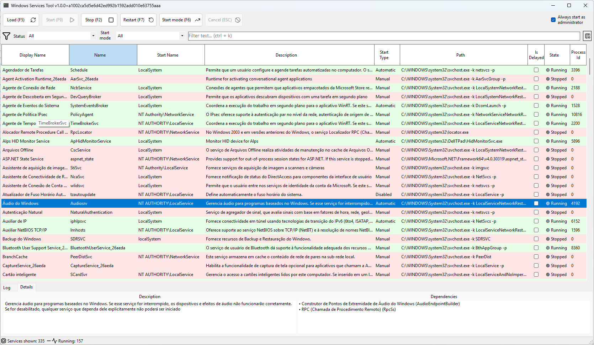

# WinServicesTool

[](https://github.com/dougcunha/WinServicesTool/actions/workflows/build.yml) [](https://github.com/dougcunha/WinServicesTool/actions/workflows/tests.yml)

A Windows Services manager tool to easily view and control Windows services (start, stop, restart). Designed as a lightweight GUI utility for power users and administrators who need quick control and organization of services on Windows machines.

## Table of Contents

- [Features](#features)
- [Roadmap](#roadmap)
- [Screenshots](#screenshots)
- [Requirements](#requirements)
- [Installation](#installation)
- [Usage](#usage)
- [Saved Services List (Favorites)](#saved-services-list-favorites)
- [Permissions](#permissions)
- [Development](#development)
- [Contributing](#contributing)
- [License](#license)

## Features

- List all installed Windows services with their current status.
- Start, Stop and Restart services from the UI.
- Filter and search services by name, display name or status.
- Sort services by name, status or startup type.
- Edit service properties (startup type, display name and description) where supported.
- Simple, responsive UI with logging support (NLog) for troubleshooting.

## Roadmap

- Remove/uninstall entries (where permitted by Windows and the current user privileges).
- Save a custom list of services (favorites) to quickly access important services in a dedicated tab.
- Export/Import saved lists for sharing or backups.

## Screenshots



## Requirements

- Windows 10 or newer (desktop) with .NET 10.0 runtime installed.
- Administrator privileges to control services (start/stop/restart/edit/remove).
- Optional: Visual Studio 2022/2026 or .NET SDK to build from source.

## Installation

There are two main ways to run WinServicesTool:

1. Download a prebuilt binary (from Releases) and run the executable.
2. Build from source.

Build from source

1. Clone the repository:

    ```powershell
    git clone https://github.com/dougcunha/WinServicesTool.git
    cd WinServicesTool
    ```

2. Open the solution `WinServicesTool.slnx` in Visual Studio or build with the .NET SDK:

    ```powershell
    dotnet build WinServicesTool/WinServicesTool.csproj -c Release
    ```

3. The compiled executable will be under `WinServicesTool/bin/Debug/net10.0-windows/` (or `Release`).

## Usage

1. Run the `WinServicesTool.exe` as administrator:

    ```powershell
    # Right-click the executable and choose "Run as administrator" or
    Start-Process -FilePath .\WinServicesTool.exe -Verb RunAs
    ```

2. Browse the list of services.
3. Use the filter box to find services by name or status.
4. Select a service and use the Start / Stop / Restart buttons.
5. To persist a set of services, add them to the "Saved Services" tab (Favorites).

Notes

- Some operations (like uninstalling or changing startup type) may be blocked by Windows or require elevated permissions.
- The app uses `System.ServiceProcess.ServiceController` and standard Windows APIs — behavior follows Windows service security rules.

## Saved Services List (Favorites)

You can create and maintain a list of frequently used services. Features:

- Add / Remove services from your saved list.
- Quickly switch to the saved list tab to view only those services.
- Export saved lists to a file for backup or sharing.
- Import saved lists to restore or load a friend's / team list.

File format for Export/Import

- The app serializes the saved list into a simple JSON file with service names and optional metadata.

## Permissions

The tool requires administrator rights to perform most actions on services. Without elevated permissions the app will still list services but will be limited to read-only operations for many services.

Tips to run as admin:

- Right-click the .exe and choose "Run as administrator".
- Use PowerShell to start with elevation: `Start-Process -FilePath .\WinServicesTool.exe -Verb RunAs`.

## Development

Project details:

- Language: C#
- Framework: .NET 10.0 (Windows Desktop)
- Logging: NLog

Open the solution in Visual Studio and run.

Recommended tasks

- Run the project from Visual Studio with Administrator privileges when testing service control features.
- Modify `nlog.config` to adjust logging verbosity and targets.

Building and running from command-line

```powershell
dotnet build WinServicesTool/WinServicesTool.csproj -c Debug
Start-Process -FilePath "WinServicesTool/bin/Debug/net10.0-windows/WinServicesTool.exe" -Verb RunAs
```

## Contributing

Contributions are welcome. Please follow these guidelines:

1. Fork the repository and create a feature branch.
2. Keep commits small and focused.
3. Add tests where feasible and run them locally.
4. Open a pull request describing the change and why it's needed.

Suggested improvements

- Add unit/integration tests for non-UI logic.
- Add automated packaging and CI (GitHub Actions) to build releases.
- Add localization support for multiple languages.

Code of Conduct

This project follows a standard open-source code of conduct. Be respectful and inclusive.

## Security

- The application uses Windows service APIs and requires admin rights for control operations; never run untrusted builds with elevated privileges.
- Report security issues via the repository's issue tracker and avoid disclosing them publicly until fixed.

## License

This project is licensed under the terms in `LICENSE.txt`.